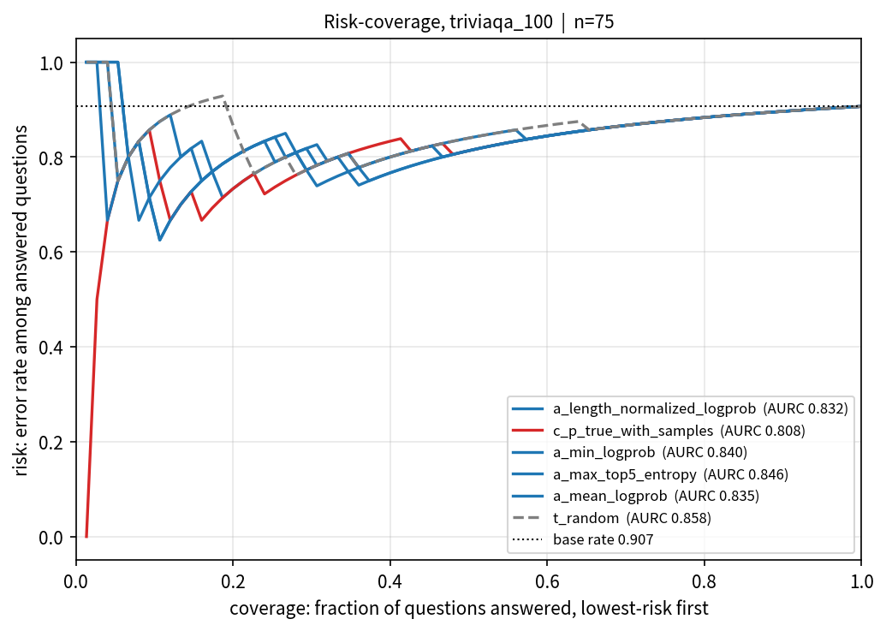

# Which cheap uncertainty signal best predicts an LLM's factual errors?

Three families of uncertainty signal are computed on the same greedy answer to
the same 100 TriviaQA questions, and each is scored by AUROC against judged
correctness: token logprobs (1x the cost of just answering), self-consistency
over 5 extra samples (measured 5.99x), and self-verification / P(True)
(measured 1.52x for the plain variant).

## Result

AUROC for discriminating a correct answer from an incorrect one, over the 75
rows where the model committed to an answer. Higher is better; 0.5 is chance.
CI is a 95% stratified percentile bootstrap over 10,000 resamples.

| signal | family | cost | AUROC | 95% CI | ECE | AURC |
| --- | --- | --- | --- | --- | --- | --- |
| length-normalized logprob | A | 1.00x | **0.826** | [0.708, 0.922] | 0.047 | 0.832 |
| P(True) with samples | C | 6.95x | 0.818 | [0.684, 0.933] | 0.053 | 0.808 |
| min token logprob | A | 1.00x | 0.811 | [0.697, 0.905] | 0.074 | 0.840 |
| max top-5 entropy | A | 1.00x | 0.788 | [0.662, 0.895] | 0.097 | 0.846 |
| total logprob | A | 1.00x | 0.784 | [0.620, 0.914] | 0.035 | 0.840 |
| perplexity | A | 1.00x | 0.784 | [0.632, 0.912] | 0.024 | 0.835 |
| mean token logprob | A | 1.00x | 0.784 | [0.632, 0.912] | 0.029 | 0.835 |
| mean pairwise token-F1 | B | 5.99x | 0.771 | [0.598, 0.913] | 0.052 | 0.841 |
| distinct-answer fraction | B | 5.99x | 0.754 | [0.572, 0.902] | 0.031 | 0.842 |
| distinct-answer count | B | 5.99x | 0.754 | [0.572, 0.902] | 0.031 | 0.842 |
| semantic entropy | B | 5.99x | 0.752 | [0.550, 0.902] | 0.015 | 0.849 |
| semantic entropy, normalized | B | 5.99x | 0.752 | [0.550, 0.902] | 0.015 | 0.849 |
| **random baseline** | T | 0.00x | **0.746** | [0.590, 0.876] | 0.048 | 0.858 |
| disagreement rate | B | 5.99x | 0.737 | [0.553, 0.899] | 0.033 | 0.847 |
| first-token logprob | A | 1.00x | 0.731 | [0.569, 0.876] | 0.072 | 0.847 |
| mean top-5 entropy | A | 1.00x | 0.727 | [0.521, 0.903] | 0.053 | 0.839 |
| answer length (baseline) | T | 0.00x | 0.687 | [0.474, 0.860] | 0.083 | 0.852 |
| first-token margin | A | 1.00x | 0.619 | [0.357, 0.857] | 0.061 | 0.845 |
| P(True) plain | C | 1.52x | 0.590 | [0.334, 0.831] | 0.151 | 0.878 |
| question length (baseline) | T | 0.00x | 0.386 | [0.150, 0.649] | 0.060 | 0.915 |
| verbalized confidence 0-100 | C | 3.17x | 0.386 | [0.206, 0.587] | 0.069 | 0.921 |

**n=100, Qwen2.5-0.5B-Instruct on CPU — confidence intervals are wide and no signal is statistically separated.**

The leader beats the runner-up by 0.007 AUROC. Every interval in the table
overlaps every other interval, and the widest is 0.500 wide (first-token
margin, [0.357, 0.857]). The finding is: **no statistically significant winner
at n=100.** That is the honest read of this run, not a placeholder for a result
that failed to arrive.

The single most damaging number in the table is the random baseline at 0.746
[0.590, 0.876]. A uniform random score should sit at 0.5. It does not, because
there are only 7 correct answers among 75 answered rows, and with a positive
class that small the sampling distribution of AUROC is wide enough that a draw
of 0.746 is unremarkable. Twelve of the twenty real signals have point estimates
below that random draw's upper bound. Any ranking read off this table is
dominated by noise, and the correct conclusion is that this run cannot
distinguish the three families.

DeLong tests with Holm-Bonferroni correction were not run: the analysis layer
does not implement DeLong, and building it was out of scope for this session.
The pairwise conclusion rests on interval overlap instead, which is the weaker
test and would only have made significance harder to claim, not easier.
AUPRC is also not implemented and those cells are therefore absent rather than
filled with a guess.



The risk-coverage curve is the practical picture, and it is bad. Selective
prediction means answering only the questions whose uncertainty is below a
threshold and abstaining on the rest. The base rate of error among answered
rows is 0.907, the dotted line. At no coverage above 11% does any signal get
error below 0.62, and coverage at the 90%-accuracy target is 0.013 for the two
signals that reach it at all — one question out of 75. There is no usable
operating point here. That is a fact about a 0.5B model on TriviaQA, not about
the signals.

Other figures: [`figures/auroc.png`](figures/auroc.png) (ranking with CIs),
[`figures/calibration.png`](figures/calibration.png) (reliability, 10 bins),
[`figures/correlation.png`](figures/correlation.png) (Spearman between signals).

## Reproduction

```bash
git clone https://github.com/urrra39/llm-uncertainty-benchmark
cd llm-uncertainty-benchmark
uv sync --extra local
export GSK_API_KEY=...            # judges only; the subject model is local
export OPENAI_BASE_URL=...        # OpenAI-compatible gateway for the judges

uv run unc-bench build-dataset  --config configs/default.yaml
uv run unc-bench generate       --config configs/default.yaml
uv run unc-bench score-signals  --config configs/default.yaml --family b
uv run unc-bench score-signals  --config configs/default.yaml --family actc
uv run unc-bench label          --config configs/default.yaml
uv run unc-bench analyze        --config configs/default.yaml
```

Family B must be a separate process from `generate`: DeBERTa and the generator
do not fit in 2 GB together. Every stage is resumable and skips rows already in
its checkpoint, so an interrupt costs only the questions in flight.

## Hardware and wall clock

No GPU, 2 CPU cores, ~2 GB RAM. Linux 6.1, Python 3.11.16, torch 2.5.1,
transformers 4.46.3.

| stage | measured | wall clock |
| --- | --- | --- |
| build-dataset | — | 2 s |
| generate (100 q, greedy + 5 samples + verification) | 18.0 s/question | 27.2 min |
| score-signals family B (NLI) | 0.98 s/question | 1.9 min |
| score-signals families A/C/baselines | — | 1.3 s |
| label (71 primary + 71 secondary judge calls) | 1.8 s and 1.3 s/item | 3.5 min |
| analyze (10,000 bootstrap resamples, 4 figures) | — | 41 s |

About 34 minutes of compute for the pipeline. Total session wall clock,
including dependency installation, the 12-question throughput probe and two
defect fixes, was about 1 hour 5 minutes.

## Model card (subject)

- **Model**: `Qwen/Qwen2.5-0.5B-Instruct`, bfloat16, local `transformers`.
- **Decoding**: greedy, temperature 0, top_p 1.0, seed 0, `max_new_tokens=24`.
  Self-consistency samples: 5 at temperature 0.7, top_p 0.9, seeds 1000+.
- **Prompt**: fixed system prompt instructing a shortest-span answer and the
  literal token `UNKNOWN` when the model does not know. The prompt string is
  part of the cache key, so it cannot drift silently between rows.
- **Why 0.5B**: family A needs token logprobs, the available API gateway
  returns none for any model it allows, so the subject model had to run
  locally. On 2 CPU cores a 7B model is roughly 20x slower and would not have
  produced a completed run. This is the largest single compromise in the study.

## Dataset card

- **Source**: TriviaQA `rc.nocontext`, validation split, 17,944 candidate rows,
  read from the Hub parquet endpoint.
- **Sample**: 100 questions, `numpy` default_rng seed 12345, drawn from the
  candidates sorted by qid so the draw is reproducible.
- **Gold answers**: the full alias list per question (`value`, `aliases`,
  `normalized_aliases`), median 19.5 aliases per question (min 2, max 118),
  matched after the project's own normalization.
- **Known defect in the source**: the split repeats `question_id` for questions
  paired with multiple evidence documents. With context stripped those rows are
  identical; the builder keeps the first occurrence.

## Labels and inter-judge agreement

| category | count |
| --- | --- |
| abstained (`UNKNOWN`) | 25 |
| correct | 7 |
| incorrect | 68 |

Abstention is its own category and is excluded from the AUROC computation.
Counting a refusal as an error would inflate every signal, because a refusal is
trivially predictable from the logprob of a token the model was instructed to
emit.

Labeling is exact match against the alias list first (settled 4 correct plus 25
abstentions), then `gpt-5-mini` at temperature 0 with a strict CORRECT /
INCORRECT / AMBIGUOUS rubric on the remaining 71 rows, then `claude-haiku-4-5`
as an independent second judge on all 71 of the same rows.

**Cohen's κ = 1.000** on n=71, observed agreement 1.000, expected agreement
0.919. Zero parse failures on either judge, zero rows fell back to the fuzzy
heuristic. The two judges agreed on all 71 items. κ=1.0 is a suspiciously
clean number and it should be read with the base rate in mind: 64 of the 71
judged rows are incorrect, most of them obviously so (the model answered "The
Wizard of Oz" where the gold is "The Third Man"), so the task the judges were
given was easy. Perfect agreement on an easy task is weak evidence that the
judges would agree on a hard one.

`data/human_validation_sample.csv` ships all 100 rows with qid, question, model
answer, gold aliases, the judge label and an empty `human_label` column. I did
not fill it in and I make no claim about human-judge agreement.

## What I would ship

Length-normalized logprob, thresholded to abstain when the value exceeds 1.0.
Reasoning: it is the top of the table at 0.826, it is free — the logprobs come
back from the same forward pass that produced the answer, at 1.00x cost — and
its ECE of 0.047 after Platt scaling is among the better-calibrated signals. At
that threshold, on this run, the system answers 14 of 75 questions (19%
coverage) and 4 of those 14 are correct, so error among answered questions is
0.714 against a base rate of 0.907. That is a real 19-point reduction in error
rate and it is also nowhere near shippable.

The honest recommendation is therefore conditional: ship the free signal,
because paying 5.99x for self-consistency bought 0.055 *less* AUROC on this run
and paying 3.17x for verbalized confidence bought a signal that is worse than
chance (0.386, i.e. the model's stated confidence is mildly anti-correlated
with being right). But do not ship this model on this task at any threshold.
The thing to fix is the 90.7% base error rate, not the uncertainty signal
ranking on top of it.

## Limitations

See [LIMITATIONS.md](LIMITATIONS.md). The short version: n=100 with 7 positives
is too small to separate 21 signals, the subject model is 14x smaller than
intended, the random baseline drew 0.746 which tells you how much noise is in
every other row of the table, and DeLong/AUPRC were not computed.

Decisions, measured rates and every scope cut are in
[docs/DECISIONS.md](docs/DECISIONS.md).

## License

MIT.
