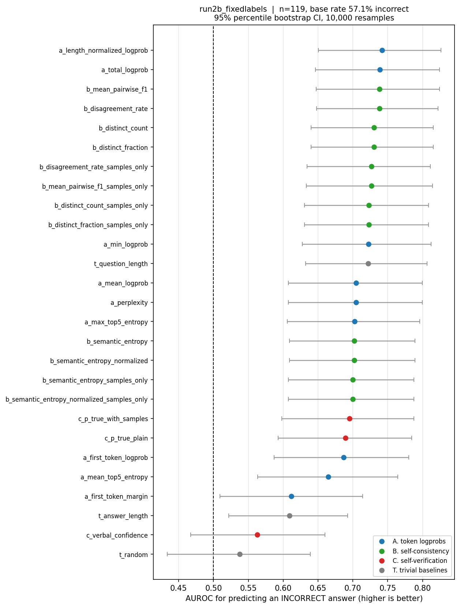
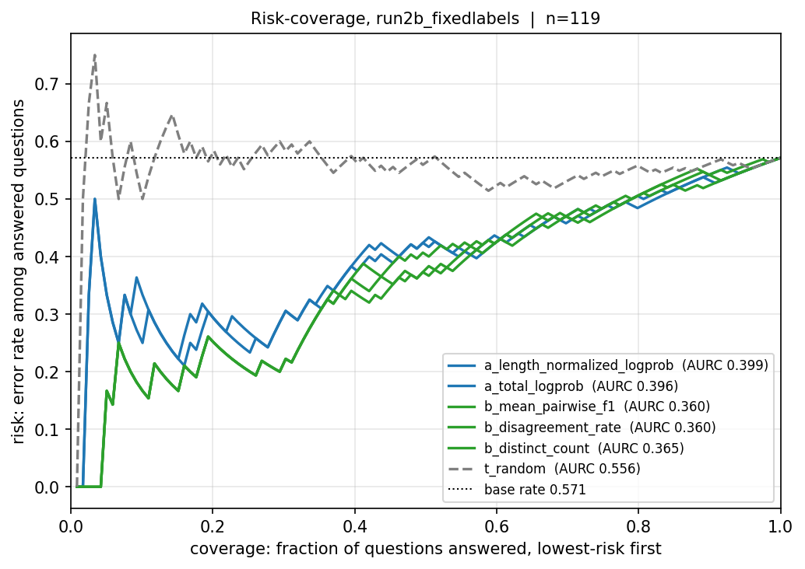
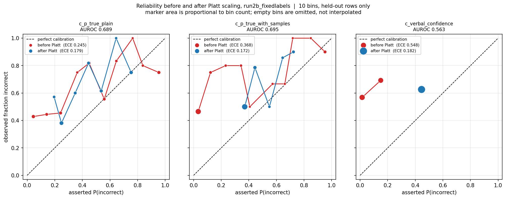
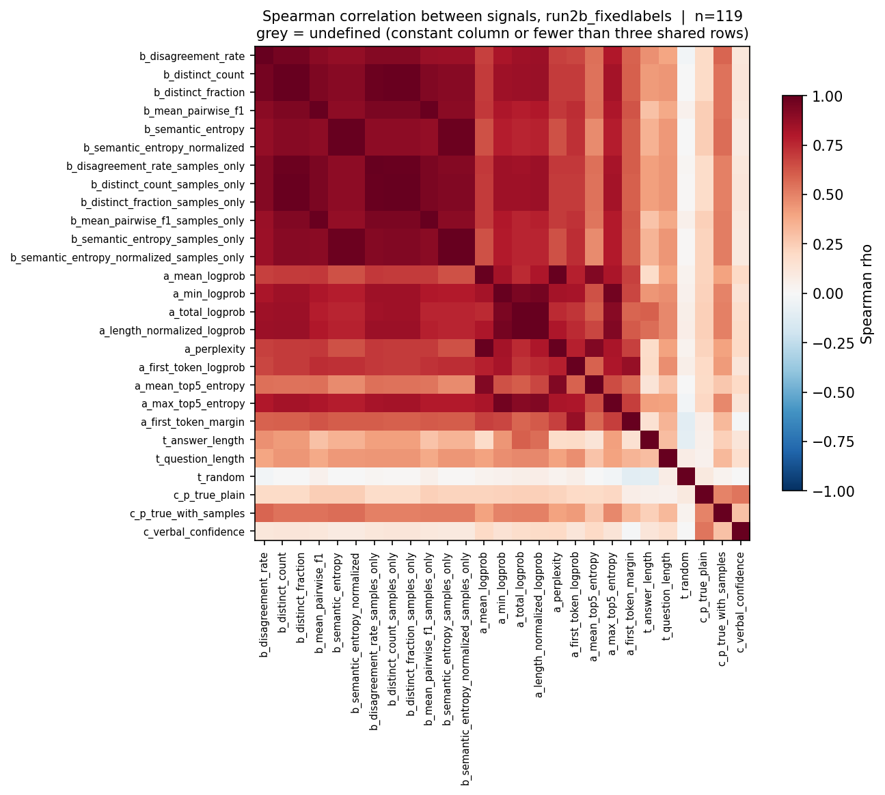
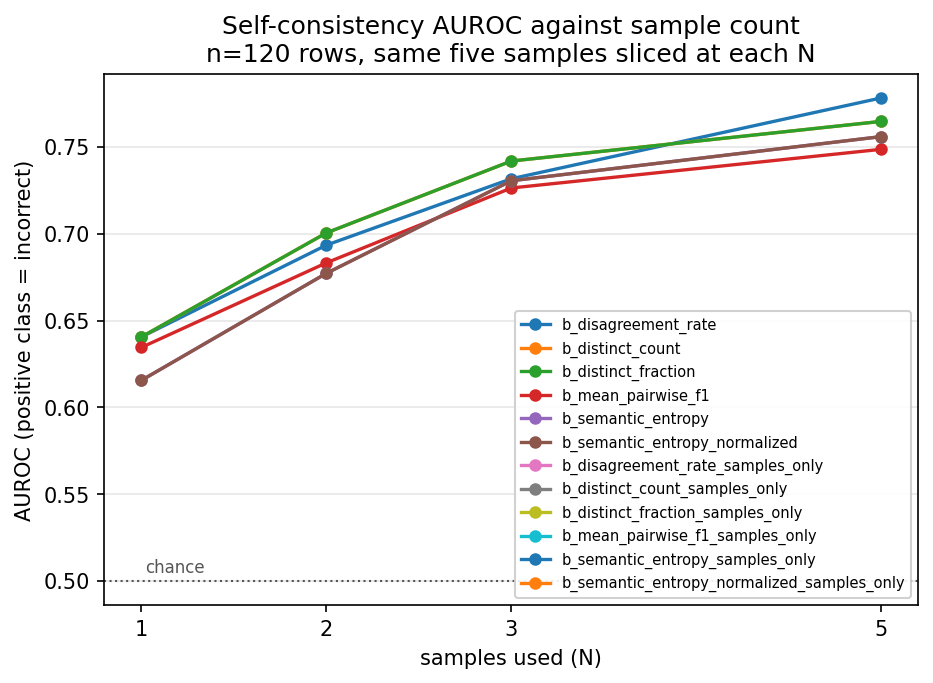
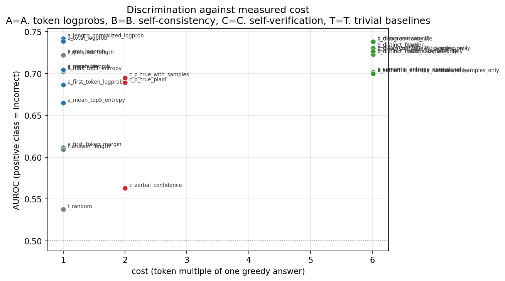

# Which cheap uncertainty signal best predicts an LLM's factual errors?

A benchmark ranking uncertainty signals — token logprobs, self-consistency,
self-verification, and trivial baselines — by how well each predicts that
Qwen2.5-0.5B-Instruct answered a short factual question wrong.

> Status, generated from `results_run2b_fixedlabels.json` (`scripts/render_readme_header.py`):
> Primary run: run2b_fixedlabels (n=119, 68 incorrect / 51 correct) [results_run2b_fixedlabels.json#run_name, views.primary.n, views.primary.n_incorrect, views.primary.n_correct].
> VALIDITY FAILED: per_dataset_class_counts, labeling_protocol_validated, human_label_coverage as recorded in results_run2b_fixedlabels.json#validity_gates (t_random pooled, results_run2b_fixedlabels.json#views.primary.signals.t_random: 0.538 [0.433, 0.639]).
> Label quality: 0/100 human-labelled (data/human_validation_sample_run2b_fixed.csv ROW:human_label) — lower bound on machine-label error 6/120 (5.0%) proven by code (data/label_error_audit.json); human labels are the only upper bound.

> **The single remaining gate is human.** No human has verified a single label
> in this repository, and both human gates read 0.0. The step is minutes, not
> an evening: `uv run unc-bench label-human --run run2b` walks
> `data/fuzzy_decided_rows_fixed.csv` (label 59 rows in total, shared rows
> first — `unc-bench label-plan` prints the order), then
> `uv run unc-bench human-agreement --csv data/human_validation_sample_run2b_fixed.csv`.
> Full convention in [docs/HUMAN_LABELING.md](docs/HUMAN_LABELING.md).

> **The honest ceiling, stated first.** n=120 on one 0.5B subject model caps
> this benchmark's scientific weight regardless of execution quality
> ([docs/CEILING.md](docs/CEILING.md)). At 60 rows per subset with base rates
> of 38% and 76% incorrect, the analytic half-width is about 0.145 per
> column: only large effects separate from chance, and a single small model's
> error pattern says nothing about uncertainty in general. No amount of
> gating, bootstrapping or documentation raises that; the honest score of
> this repository as science is bounded, however high its engineering marks
> climb. What lifts the ceiling is run #3 (n=600 on a GPU,
> [docs/PREREGISTRATION.md](docs/PREREGISTRATION.md)) plus a second subject
> model from a different family.

## The result, plainly

Run #2b is run #2's exact configuration (Qwen2.5-0.5B-Instruct, same
decoding, prompts, sampling, NLI) on a decontaminated dataset — no `capital
of` relation, gold-in-question rows dropped, near-duplicates deduped, a
balanced 60 PopQA / 60 TriviaQA split. It was pre-registered before execution
([docs/PREREGISTRATION.md](docs/PREREGISTRATION.md), "Run #2b" section). The
numbers published here are computed from the **corrected** label set, under
the fixed no-judge rule (`data/run2b/labels_fixed.parquet`); the pre-fix
label set is archived as a labelled sensitivity comparison below.

**Null result, stated first: at n=119 with stratified bootstrap intervals,
nothing separates.** All 27 scored signals (22 distinct orderings plus 5
rank-equivalent duplicates) have stratified intervals overlapping the
leader's band [0.601, 0.802] end to end. No point estimate in the table is
distinguishable from any other by its marginal interval, and only one signal
is significantly worse under the paired test. This is not a claim that the
signals are useless — it is the claim this sample can support: that it cannot
rank them.

<!-- TENSION:BEGIN -->
Why the null leads while the significance test can still reject: the two tests answer different questions. Marginal-interval overlap asks whether two point estimates can be told apart on their own — the conservative read, and why the null leads. The paired bootstrap on AUROC differences asks whether one signal beats another on the same rows, exploiting their correlation; that is the test with the power to reject. Here: 27 of 27 signals' intervals overlap the leader's band [0.601, 0.802], while `a_first_token_margin` is significantly worse after Holm.
<!-- TENSION:END -->

The per-dataset table below is the primary result; the pooled table under it
is supporting material (finding: a signal correlated with dataset provenance
earns pooled AUROC for free — the pooled number is not a clean quantity at
these differing base rates). Findings, stated flatly:

- **No signal separates from the leader** (`b_mean_pairwise_f1`, stratified
  0.705 [0.601, 0.802]). The verification signal `c_p_true_plain` (family C,
  2× cost) is next at 0.699 [0.590, 0.807]; the family-A logprobs sit inside
  the same band. The top of the table is an ordering of point estimates, not
  an ordering the data supports.
- **The pooled table has no winner either**: `a_length_normalized_logprob`
  0.742 [0.651, 0.826] leads `a_total_logprob` 0.739 [0.646, 0.824] by 0.003
  with overlapping CIs.
- **One signal is significantly worse after Holm** (paired percentile
  bootstrap on the AUROC difference within shared rows, Holm–Bonferroni over
  21 distinct comparisons): `a_first_token_margin`, delta −0.130,
  p_holm = 0.046. The trivial baselines do not reject under the corrected
  labels (`t_random` delta −0.204, p_holm = 0.083) — a change from the pre-fix
  set, where five signals rejected (see the sensitivity section).
- **`c_p_true_plain` leads the PopQA column at 0.828 [0.706, 0.929]** — the
  verification signal is strongest on the subset where the labels were
  length-biased before correction, because P(True) is essentially
  length-independent (Spearman with answer length 0.049).
- **Correcting the labeler attenuated exactly the length-correlated
  signals** (the round's central measurement, below): the top family-A
  numbers of the pre-fix table were partly a labeler artifact, not signal.
- **`t_question_length` is at chance within PopQA** (0.499 [0.393, 0.609])
  and its pooled-vs-stratified gap (0.722 pooled vs 0.577 stratified) is
  provenance detection, not uncertainty detection. A word count of the
  question outranks it on the primary subset's own terms only where the
  datasets differ.
- **The N-ablation does not saturate at N=3**: 0.641 / 0.700 / 0.742 / 0.765
  at N=1/2/3/5; "use N=3" survives as cost advice, not as a measured optimum.
- **E4, the decontamination prediction, clears chance but is not cleanly
  attributable.** `a_mean_logprob` on PopQA sits at 0.698 [0.553, 0.833]
  against its withdrawn run-#2 baseline (0.514, directional only) — above
  chance, but lower than the pre-fix 0.740, and the move is not established
  as decontamination rather than labeler change until the human gate reports.
- **The clustering audit is small**: 4 disagreements in 120 rows audited
  (rate 0.033, Wilson 95% [0.013, 0.083]); family-B numbers stand under
  either clusterer. Family-B cost is 6.0× calls measured at 6.01× tokens.

Three classical gates pass and three fail. The failures are the design: two
are human gates nobody has opened, and one is the per-dataset class floor
that run #3's 300/300 split exists to clear.

| gate | status | observed |
|---|---|---|
| random_baseline_ci_contains_chance | PASS | AUROC 0.538 [0.433, 0.639] |
| minimum_rows_per_class | PASS | 68 incorrect, 51 correct |
| abstention_rate_below_ceiling | PASS | 0/119 = 0.000 |
| per_dataset_class_counts | FAIL | popqa 23/37; triviaqa 45/14 |
| labeling_protocol_validated | FAIL | coverage 0.000 |
| human_label_coverage | FAIL | coverage 0.000 |

<!-- LABELLING:BEGIN -->
To open the gates, label 59 rows, shared-first: `data/fuzzy_decided_rows_fixed.csv` (59 of 73 for `human_label_coverage`), then `data/human_validation_sample_run2b_fixed.csv` to 54 of 100 for `labeling_protocol_validated`. Wall clock: 59 rows x per-row rate (unmeasured; roughly 19-39 min at 20-40 s/row). Gate names: `human_label_coverage`, `labeling_protocol_validated`.
<!-- LABELLING:END -->

By the project's own rule the ranking is **not publishable as a finding**
until the human gates pass. It is shown here as a measurement with that
status attached.

### Run #2b per-dataset AUROC (60/60, real bootstrap intervals)

Column power: PopQA's minority class is 23 and TriviaQA's is 14, both below
the project's ≥30 floor (`per_dataset_class_counts` fails), so neither column
should be read as a powered ranking; the next run must target ≥30 per class
*within* each dataset. Selection rule, stated so curation cannot hide in it:
all 22 distinct scored signals (5 rank-equivalent duplicates in the
appendix), sorted by stratified AUROC descending, PopQA AUROC breaking ties.
Every interval below overlaps the leader's [0.601, 0.802] end to end — there
is no below-the-line here.

| signal | PopQA (23/37) | TriviaQA (45/14) | stratified |
|---|---|---|---|
| `b_mean_pairwise_f1` | 0.709 [0.580, 0.835] | 0.701 [0.543, 0.849] | 0.705 [0.601, 0.802] |
| `c_p_true_plain` | 0.828 [0.706, 0.929] | 0.568 [0.384, 0.751] | 0.699 [0.590, 0.807] |
| `b_disagreement_rate` | 0.722 [0.596, 0.845] | 0.660 [0.500, 0.816] | 0.691 [0.588, 0.789] |
| `b_mean_pairwise_f1_samples_only` | 0.687 [0.558, 0.816] | 0.682 [0.519, 0.835] | 0.684 [0.577, 0.785] |
| `b_distinct_count` | 0.701 [0.575, 0.826] | 0.655 [0.494, 0.806] | 0.678 [0.575, 0.777] |
| `a_length_normalized_logprob` | 0.747 [0.606, 0.872] | 0.602 [0.449, 0.751] | 0.675 [0.572, 0.773] |
| `b_disagreement_rate_samples_only` | 0.692 [0.563, 0.821] | 0.647 [0.482, 0.805] | 0.670 [0.566, 0.770] |
| `a_total_logprob` | 0.759 [0.623, 0.881] | 0.573 [0.416, 0.727] | 0.667 [0.563, 0.767] |
| `b_distinct_count_samples_only` | 0.683 [0.553, 0.813] | 0.643 [0.479, 0.799] | 0.663 [0.558, 0.763] |
| `a_min_logprob` | 0.706 [0.559, 0.840] | 0.589 [0.421, 0.757] | 0.648 [0.536, 0.756] |
| `b_semantic_entropy` | 0.619 [0.492, 0.750] | 0.665 [0.507, 0.816] | 0.642 [0.538, 0.741] |
| `a_mean_logprob` | 0.698 [0.553, 0.833] | 0.571 [0.405, 0.735] | 0.635 [0.526, 0.741] |
| `b_semantic_entropy_samples_only` | 0.603 [0.476, 0.735] | 0.663 [0.495, 0.820] | 0.633 [0.526, 0.735] |
| `a_max_top5_entropy` | 0.703 [0.558, 0.836] | 0.543 [0.373, 0.716] | 0.623 [0.511, 0.733] |
| `c_p_true_with_samples` | 0.727 [0.586, 0.855] | 0.505 [0.323, 0.694] | 0.617 [0.503, 0.733] |
| `a_first_token_logprob` | 0.582 [0.424, 0.737] | 0.616 [0.444, 0.781] | 0.599 [0.479, 0.711] |
| `a_mean_top5_entropy` | 0.680 [0.535, 0.818] | 0.511 [0.349, 0.676] | 0.596 [0.487, 0.705] |
| `t_question_length` | 0.499 [0.393, 0.609] | 0.657 [0.483, 0.819] | 0.577 [0.475, 0.674] |
| `t_answer_length` | 0.562 [0.459, 0.671] | 0.503 [0.340, 0.665] | 0.533 [0.439, 0.627] |
| `c_verbal_confidence` | 0.504 [0.366, 0.641] | 0.550 [0.393, 0.710] | 0.527 [0.423, 0.632] |
| `t_random` | 0.481 [0.329, 0.633] | 0.570 [0.403, 0.729] | 0.525 [0.409, 0.637] |
| `a_first_token_margin` | 0.580 [0.418, 0.739] | 0.452 [0.284, 0.627] | 0.517 [0.397, 0.637] |

Five rank-equivalent duplicates (`a_perplexity`, `b_distinct_fraction`,
`b_semantic_entropy_normalized`, `b_distinct_fraction_samples_only`,
`b_semantic_entropy_normalized_samples_only`) are appendix material, as
established: identical numbers, no information, no Holm penalty.

### Supporting: pooled AUROC, raw across both datasets

Sort key is the pooled point estimate; this table exists for continuity and
must not be quoted as a finding (a provenance-correlated signal earns pooled
AUROC for free at these base rates — `t_question_length`'s 0.722 pooled
against 0.499 on PopQA is the demonstration).

| signal | pooled AUROC | AUPRC |
|---|---|---|
| `a_length_normalized_logprob` | 0.742 [0.651, 0.826] | 0.804 |
| `a_total_logprob` | 0.739 [0.646, 0.824] | 0.788 |
| `b_mean_pairwise_f1` | 0.738 [0.647, 0.824] | 0.749 |
| `b_disagreement_rate` | 0.738 [0.648, 0.822] | 0.751 |
| `b_distinct_count` | 0.731 [0.640, 0.815] | 0.743 |
| `b_disagreement_rate_samples_only` | 0.727 [0.634, 0.811] | 0.741 |
| `b_mean_pairwise_f1_samples_only` | 0.727 [0.633, 0.814] | 0.740 |
| `b_distinct_count_samples_only` | 0.723 [0.631, 0.808] | 0.738 |
| `a_min_logprob` | 0.723 [0.627, 0.812] | 0.760 |
| `t_question_length` | 0.722 [0.632, 0.807] | 0.759 |
| `a_mean_logprob` | 0.705 [0.607, 0.800] | 0.727 |
| `a_max_top5_entropy` | 0.703 [0.606, 0.796] | 0.729 |
| `b_semantic_entropy` | 0.702 [0.609, 0.789] | 0.728 |
| `b_semantic_entropy_samples_only` | 0.700 [0.608, 0.787] | 0.722 |
| `c_p_true_with_samples` | 0.695 [0.598, 0.788] | 0.725 |
| `c_p_true_plain` | 0.689 [0.593, 0.784] | 0.750 |
| `a_first_token_logprob` | 0.687 [0.587, 0.780] | 0.750 |
| `a_mean_top5_entropy` | 0.665 [0.563, 0.765] | 0.675 |
| `a_first_token_margin` | 0.612 [0.509, 0.714] | 0.658 |
| `t_answer_length` | 0.609 [0.522, 0.693] | 0.656 |
| `c_verbal_confidence` | 0.563 [0.467, 0.660] | 0.608 |
| `t_random` | 0.538 [0.433, 0.639] | 0.645 |

## The significance verdict

Paired percentile bootstrap on the AUROC difference within shared rows (10,000
resamples, identical resample indices across both signals), Holm–Bonferroni
over the 21 distinct comparisons, against the stratified leader. That is the
test with the power to reject, and it rejects exactly one signal:
`a_first_token_margin` (delta −0.130, p_holm = 0.046). Every other signal,
including the trivial baselines, is indistinguishable from the leader after
multiplicity correction. The pre-fix label set produced five rejections
(including `t_random` at p_holm = 0.0076); the corrected set does not — the
extra rejections were partly manufactured by the length-biased labeler, which
is itself a measured finding about the *labels*, not about the signals.

## What the corrected labels changed (the sensitivity comparison)

The pre-fix label set — the containment rule the Round-11 code sweep proved
wrong on 6 of 120 rows (5.0%), a lower bound — remains committed as
`results_run2b.json` (`configs/run2b_clean.yaml`); its figures
(`figures/run2b/auroc.png`, `figures/run2b/correlation.png`,
`figures/run2b/cost_vs_auroc.png`, `figures/run2b/n_ablation.png`,
`figures/run2b/reliability.png`, `figures/run2b/risk_coverage.png`) are
archived beside it. The table above is computed
from `results_run2b_fixedlabels.json`. Both label sets and both results files
are committed; the comparison is the measurement, and the two runs are not
scored on identical rows (the fixed set drops one rule-ambiguous row, so n is
119), so no paired test spans them. `unc-bench compare-runs
results_run2b.json results_run2b_fixedlabels.json` prints every signal side
by side. The like-for-like deltas on the shared 119 rows
(`data/labeler_variance_run2b.json`):

- **Counts move 71 incorrect / 49 correct to 68 / 51 at n=119** (one row,
  `triviaqa-jp_1520`, becomes rule-ambiguous and is excluded, never coerced).
- **The only pooled deltas whose interval excludes zero are the
  length-correlated signals**: `a_total_logprob` −0.066 [−0.130, −0.015]
  (0.805 to 0.739 on the shared rows), `a_length_normalized_logprob` −0.056
  [−0.115, −0.011] (0.798 to 0.742), `t_answer_length` −0.070 [−0.137,
  −0.016] (0.680 to 0.609). Every other signal's delta interval spans zero.
- **Stratified, the table's sort key**: the pre-fix column-top
  `b_disagreement_rate` falls 0.747 to 0.691 [0.588, 0.789]; the fixed-label
  top is `b_mean_pairwise_f1` 0.705 [0.601, 0.802] with `c_p_true_plain`
  0.699 [0.590, 0.807]. The family-A logprobs drop inside the same band:
  `a_total_logprob` 0.741 to 0.667 [0.563, 0.767] and
  `a_length_normalized_logprob` 0.734 to 0.675 [0.572, 0.773].
- **PopQA column**: the old column's highest number, `a_total_logprob` 0.825,
  falls to 0.759 [0.623, 0.881]; the fixed-label PopQA column is led by
  `c_p_true_plain` 0.828 [0.706, 0.929] — the verification signal the old
  labeler had been punishing on exactly the long verbatim answers it marked
  wrong.
- **The mechanism, stated flatly**: a length-biased labeler plus a
  length-correlated signal manufactures AUROC that measures neither
  uncertainty nor correctness. `a_total_logprob` correlates with answer
  length (0.594) more than with the label (0.519), and its within-above-
  median-length AUROC collapses from 0.855 [0.731, 0.951] to 0.714 [0.536,
  0.873] under the fixed labels — flat against its short-stratum 0.711.
  `t_answer_length` is length by definition (Spearman 1.0) and keeps almost
  nothing once length is removed (partial 0.128). Full per-signal audit in
  `data/length_confound_audit.json`.
- **E4 under the fixed labels**: `a_mean_logprob` on PopQA 0.740 to 0.698
  [0.553, 0.833] — the decontamination move still clears chance, but its
  height was partly labeler artifact. The pre-registered E4 outcome
  paragraphs (PREREGISTRATION, "E4 outcome lines, pre-written") are gated on
  the human fuzzy-rule accuracy report; none is pasted before that report
  exists.

## Figures

All drawn from `results_run2b_fixedlabels.json` alone (`unc-bench figures
--config configs/run2b_fixedlabels.yaml`):








## Reproduction

```bash
uv sync --extra local
uv run unc-bench build-dataset  --config configs/run2b_clean.yaml
uv run unc-bench generate       --config configs/run2b_clean.yaml
uv run unc-bench score-signals  --config configs/run2b_clean.yaml --family b
uv run unc-bench score-signals  --config configs/run2b_clean.yaml --family actc
uv run unc-bench ablation       --config configs/run2b_clean.yaml
uv run unc-bench label          --config configs/run2b_clean.yaml  # heuristic: no judge key here
uv run python scripts/relabel_run2b.py     # writes the corrected labels_fixed.parquet
uv run unc-bench analyze        --config configs/run2b_fixedlabels.yaml  # the published results file
uv run unc-bench figures        --config configs/run2b_fixedlabels.yaml
```

Family B runs as its own pass. Labels fall back to exact match plus the fuzzy
rule without judge credentials (recorded, not hidden). The published numbers
are the fixed-label analyze; re-running `analyze` reproduces
`results_run2b_fixedlabels.json` bit-identically apart from the timestamp
(measured, D13). Planned next: run #3 at n=600 on a GPU
(`configs/run3_gpu.yaml`, pre-registered in
[docs/PREREGISTRATION.md](docs/PREREGISTRATION.md), never executed).

## Hardware, runtime and costs

Run #2b ran on this machine — an Apple-silicon Mac (macOS, arm64, Python
3.11.16), CPU only. Measured from the run's own `data/run2b/timings.json`:
generation 6.13 s/question (735 s for 120 questions, 840 cache misses, zero
failures); family B 0.48 s/item. Cost model (`results_run2b_fixedlabels.json`
`cost`): family A is free (logprobs arrive with the greedy answer), family B
is 6.0× calls (5 samples plus one NLI pass, measured 6.01× tokens),
family C is 1× (one extra scoring pass), family T is free. These are
call-count costs; wall-clock ratios are this hardware only and a GPU changes
them.

## Model and dataset cards

- **Subject model:** Qwen2.5-0.5B-Instruct, bfloat16, CPU, greedy at
  temperature 0 / top_p 1.0 / seed 0, `max_new_tokens: 24`, 5 samples at
  temperature 0.7 for family B. Per-question sample seeds make sampled tokens
  width-invariant. `generation_batch_size` is pinned at 1 by open defect D27.
- **PopQA (60 rows):** a balanced slice of the four lookup relations
  (`capital`, `country`, `sport`, `color`) minus `capital of`, restricted to
  the 90th-percentile popularity slice — which, measured, is ~92% "capital of
  a country", so the realized column is effectively a single template (59 of 60
  rows; C1). Gold aliases are from the Wikidata test set; 7 leaked rows were
  dropped before the draw (192 unique in the filtered pool).
- **TriviaQA (60 rows):** the easy slice (`min_aliases: 20`), 314 gold-leakage
  rows dropped, 3,746 unique in the pool.
- **NLI:** MoritzLaurer/DeBERTa-v3-base-mnli for family-B clustering
  (entailment threshold 0.5), full-audited on every row
  (`force_full_audit: true`).

## Label provenance

Every number above stands on a machine-assigned label set. Run #2b's labels
are heuristic: 47 rows settled by normalized exact match, 72 by the fixed
fuzzy rule, and 1 (`triviaqa-jp_1520`) left ambiguous by the rule and excluded
pending a human. There is no judge-versus-judge κ for run #2b — one
deterministic labeler cannot be scored against itself — and the run #2
judge-versus-judge κ of 0.849 over 66 rows does not cover run #2b. The label
set's error is measured only from below: the code sweep in
`scripts/audit_label_errors.py` proves the *pre-fix* rule was wrong on 6 of
120 rows (5.0%, `data/label_error_audit.json`), and the fixed rule corrects
exactly those six. That is a lower bound — a code sweep cannot see semantic
errors a human would. **No human has verified any label.** Human labels bound
the error from above, and until the gates pass, correctness is unmeasured in
that direction.

## What would be shipped, and at what threshold

Nothing should be shipped from this evidence. A deployment recommendation
would require an uncertainty estimator that separates from its peers and from
length at a useful operating point, on a model and n this repository does not
have. Two thresholds exist in the pipeline for a future verdict: the per-dataset
class floor (≥30 per class per dataset) and the human gates, and after them
the power at n=600 to detect a meaningful AUROC gap (`min_meaningful_auroc_gap`
0.02 in the analysis config). Run #3 is what could clear them; until a
credentialed or human-verified label set and a second subject model exist,
this repository's output is a measurement apparatus and a null result, not a
shippable signal.

## Limitations

Full account in [docs/LIMITATIONS.md](docs/LIMITATIONS.md). The ones that
travel with every number here: n=120 is small (per-column half-width ~0.145
at 30/30); the subject model is one 0.5B model, so nothing generalizes by
scale; labels are machine-assigned and unverified by any human; run #2b's
PopQA column is one question template; generation reproducibility is
unmeasured (D27 and the `nondeterminism` probe have not cleared); and the
trivial baselines are strong enough that the benchmark's difficulty lies in
beating them, which at this n nothing demonstrably does.

## History of withdrawn runs

- **Run #1** (tag `run1-n100`, `configs/default.yaml`): 7 correct of 75
  answered; `t_random` at 0.746 proved the estimator was generating the
  ordering. Discarded in full.
  [docs/WITHDRAWN_RUN2.md](docs/WITHDRAWN_RUN2.md#run-1-and-why-it-was-discarded).
- **Run #2** (`configs/run2.yaml`): withdrawn over the echo-contamination
  bound (up to 34/120 labels flippable). All tables, findings and narrative
  preserved verbatim in [docs/WITHDRAWN_RUN2.md](docs/WITHDRAWN_RUN2.md).
- **Run #2b** (`configs/run2b_clean.yaml`): current. The pre-fix label
  snapshot is archived as the comparison above; the published table is the
  fixed-label analyze (`configs/run2b_fixedlabels.yaml`).
- **Run #3** (`configs/run3_gpu.yaml`): pre-registered
  ([docs/PREREGISTRATION.md](docs/PREREGISTRATION.md)) and pre-flighted, never
  executed. No run #3 number exists anywhere in this repository.

## Acknowledgements

Sole authorship; the repository history records the owner's earlier identity.
Parts of the implementation were produced with AI assistance under the
author's direction and review.

## License

MIT. See [LICENSE](LICENSE).
